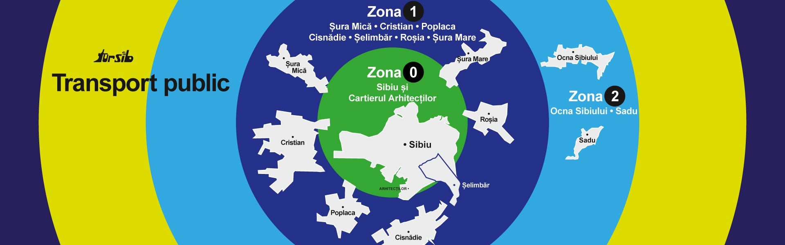

# 📍 Tursib Bus Departures – Home Assistant Integration

Această integrare personalizată adaugă senzori pentru plecările autobuzelor Tursib în Home Assistant.
Preia orarele în timp real de pe [tursib.ro](https://tursib.ro) și le expune ca senzori cu atribute pentru următoarele plecări, linie, destinație și minute până la sosire.

---
## ✨ Funcționalități
- Senzor dedicat pentru fiecare stație configurată
- Atribute detaliate: linia, destinația, ora programată, minutele rămase, tipul programului (Zi lucrătoare / Sâmbătă / Duminică) și timpul ultimei actualizări
- Actualizare automată la fiecare minut prin DataUpdateCoordinator
- Filtrare inteligentă: afișează doar plecările viitoare și trece automat la ziua următoare dacă nu mai sunt curse
- Listă mereu completă: senzorul returnează următoarele 5 plecări (azi + mâine), astfel încât cardurile Lovelace să nu rămână niciodată fără date
- Compatibilitate directă cu tursib-card pentru afișare elegantă în Lovelace
- Funcționează nativ în Home Assistant (fără AppDaemon)
- Configurare ușoară prin UI (Config Flow)
- Suport pentru HACS
---

## 📦 Instalare

### Via HACS (recomandat)
1. Deschide HACS în Home Assistant.
2. Mergi la **Integrations → Custom repositories**.
3. Adaugă URL-ul repo-ului și selectează categoria **Integration**.
4. Caută **Tursib Bus Departures** și instalează.
5. Repornește Home Assistant.

### Manual
1. Copiază folderul `custom_components/tursib/` în directorul `config/custom_components/` al Home Assistant.
2. Repornește Home Assistant.

---

## ⚙️ Configurare

### UI (Config Flow)
1. Mergi la **Settings → Devices & Services → Add Integration**.
2. Caută **Tursib Bus Departures**.
3. Introdu ID-urile și numele stațiilor (ex.: `123: Gara`, `456: Centru`). ID-urile pot fi găsite pe [tursib.ro](https://tursib.ro) în pagina fiecărei stații.
4. Senzorii vor fi creați automat.

### Example Sensor
```yaml
sensor.tursib_gara
sensor.tursib_centru
```
### Atribute Senzor
- `line`: Linia autobuzului
- `destination`: Destinația autobuzului
- `scheduled_time`: Ora programată a plecării
- `minutes_until_departure`: Minutele rămase până la plecare
- `schedule_type`: Tipul programului (Zi lucrătoare / Sâmbătă
- `last_updated`: Timpul ultimei actualizări
- `station_id`: ID-ul stației
- `station_name`: Numele stației
- `all_departures`: Listă cu următoarele 5 plecări
---
## 📄 Licență
Acest proiect este licențiat sub [MIT License](LICENSE).
---
## 🤝 Contribuții
Contribuțiile sunt binevenite! Te rugăm să deschizi un issue sau un pull request pe GitHub.
---
## 📞 Contact
Pentru întrebări sau suport, te rugăm să deschizi un issue pe GitHub.
---

## 🌟 Mulțumiri
Mulțumiri speciale comunității Home Assistant și tuturor celor care contribuie la dezvoltarea ecosistemului de integrații personalizate!
---

## ☕ Susține dezvoltatorul

Dacă ți-a plăcut această integrare și vrei să sprijini munca depusă, **invită-mă la o cafea**! 🫶  
Nu costă nimic, iar contribuția ta ajută la dezvoltarea viitoare a proiectului. 🙌  

[](https://buymeacoffee.com/clmun01c)

Mulțumesc pentru sprijin și apreciez fiecare gest de susținere! 🤗